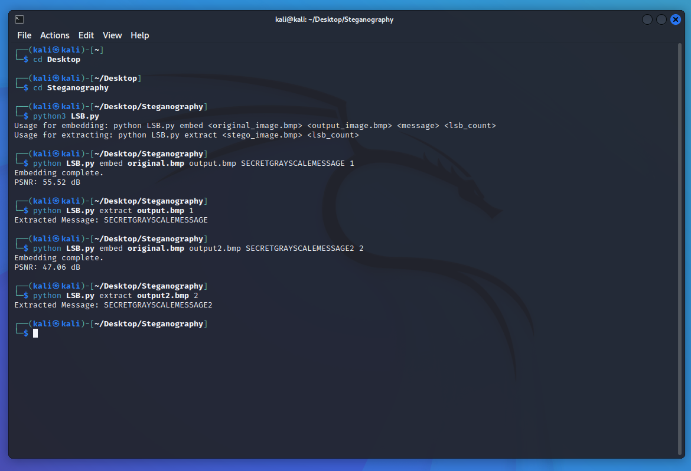
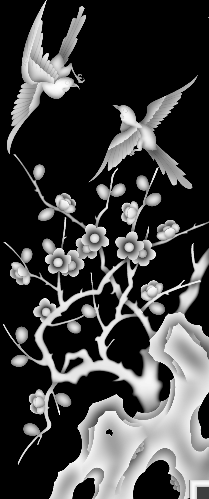
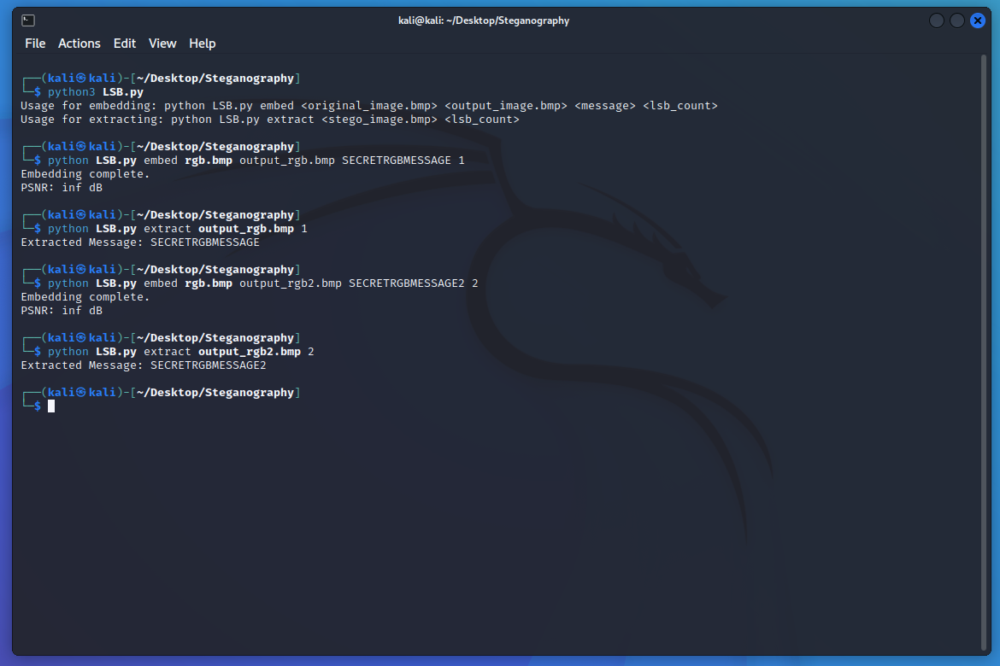
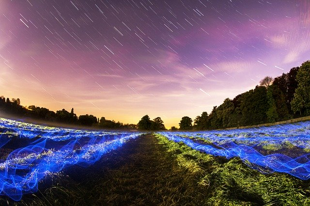
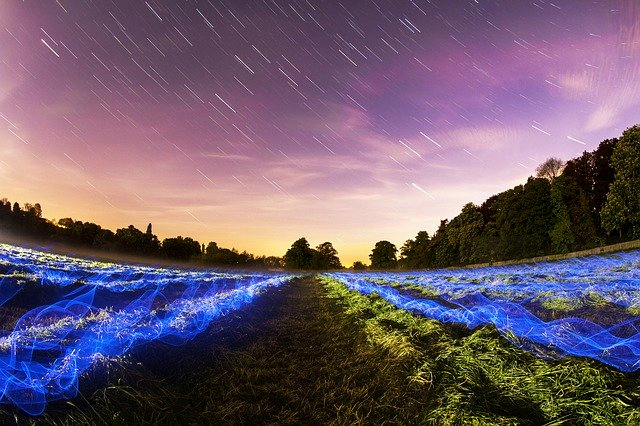

# Image Steganography Using LSB Embedding

This project focuses on **image steganography**, specifically **Least Significant Bit (LSB) embedding**, which is a method of hiding secret messages within images. The goal is to analyze the effectiveness of embedding messages in grayscale and RGB images by comparing the visual differences and evaluating the Peak Signal-to-Noise Ratio (PSNR). 

We conducted experiments to embed secret messages in 1-LSB and 2-LSB of both grayscale and RGB images to determine the optimal balance between security and image quality.

---

# Grayscale Embedding/Extracting

As seen in the screenshot below, we ran the code first, embedding **“SECRETGRAYSCALEMESSAGE”** inside only 1-LSB in a grayscale image, and then extracted the message.

We then did the same thing, embedding **“SECRETGRAYSCALEMESSAGE2”**, in 2-LSB in the same image to monitor the differences. We noticed a slightly smaller **PSNR** in the 2-LSB case, which means the 1-LSB was generally more successful, but the difference was not too significant.

### No visible difference in 1-LSB:

| Original Grayscale Image | 1-LSB Embedded Grayscale Image |
|--------------------------|-------------------------------|
|  |  |

### No visible difference in 2-LSB embedding either:

| Original Grayscale Image | 2-LSB Embedded Grayscale Image |
|--------------------------|-------------------------------|
|  |  |

---

# RGB Embedding/Extracting

Following the same steps as before, this time the **PSNR** was **infinity**. This 100% match may have been due to the number of LSBs being too small, so the change in the image was negligible. It may also be because the length of the message is too small. 

That being said, we tried to choose a larger LSB count and write a bigger message, but the **PSNR** always ended up being infinity in this case.

### As expected, no visual differences in the 1-LSB:

| Original RGB Image | 1-LSB Embedded RGB Image |
|-------------------|-------------------------|
|  |  |

### No visual differences in 2-LSB either:

| Original Image | 2-LSB Embedded RGB Image |
|----------------|-------------------------|
|  |  |

---

## Conclusion

The experiments demonstrate that LSB steganography is an effective technique for hiding information within images, especially when using 1-LSB embedding. In grayscale images, the embedded data results in minimal visual distortion, but higher embedding rates (e.g., 2-LSB or more) can introduce detectable artifacts.

In RGB images, the presence of three color channels provides a larger embedding capacity and better concealment potential, making it harder for the human eye to detect changes. However, steganalysis techniques can reveal hidden data, making it essential to use encryption and randomization alongside LSB embedding to enhance security.

For practical applications, LSB steganography should be combined with encryption and careful selection of cover images to minimize the risk of detection.
